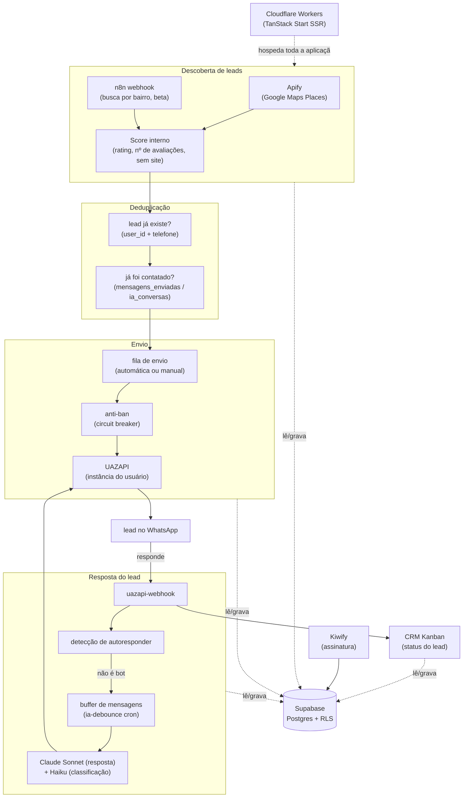

# ZapScout

SaaS B2B de prospecção automatizada de leads via WhatsApp com IA.

## O problema

Prospecção manual não escala. Encontrar a empresa, achar o contato certo, validar se o número tem WhatsApp e fazer o follow-up na hora certa é trabalho repetitivo que consome o dia inteiro de um vendedor — antes de ele conseguir falar com um único lead qualificado.

## Arquitetura



Todo cron (prospecção automática, fila de envios, follow-ups, debounce de IA) roda como rota HTTP protegida por `x-cron-secret`, chamada por `pg_cron`. O mesmo mecanismo de gate aceita chamadas externas (n8n) sem exigir sessão de usuário.

## Decisões técnicas

**Multi-tenant com RLS real, não só no papel.** As 31 tabelas do schema `public` têm Row Level Security ativo, a maioria com policy `auth.uid() = user_id` (ou join equivalente para tabelas filhas como `followups`). O único client com `service_role` — que ignora RLS — roda em `client.server.ts`, usado só em rotas server-side e crons; nunca chega ao browser.

**Circuit breaker anti-ban no envio automático.** Três falhas de envio seguidas pausam os disparos daquele usuário automaticamente: 30 minutos para falha genérica, 2 horas se o erro indicar desconexão do WhatsApp. Decisão de produto — sem isso, um número instável continuaria martelando a UAZAPI e arriscaria ban do WhatsApp da própria clínica/empresa cliente.

**Fila de envio com retry exponencial e idempotência.** `envios_manuais_fila` é processada por `pg_cron` a cada 1 minuto. Falha genérica: backoff 1-2-4-8min (cap 30min); falha de rate limit: 5-10-20-40min (cap 1h). Até 5 tentativas antes de marcar `falha`. Se o WhatsApp estiver desconectado, a linha fica pendente sem contar como tentativa — evita queimar o orçamento de retries por um problema que não é do envio em si.

**Deduplicação em múltiplas camadas antes de qualquer envio.** Antes de contatar um lead, o sistema checa (1) se já existe lead com aquele telefone para o usuário, (2) se já existe registro em `mensagens_enviadas` para aquele `lead_id`, e (3) se já existe conversa em `ia_conversas` para aquele telefone em qualquer `lead_id` — cobre duplicatas geradas por scraping do mesmo número com IDs de lugar diferentes. No lado da resposta, uma checagem de padrão de autoresponder roda antes de chamar a IA, pra não gastar chamada de modelo nem responder a um bot em loop.

## Stack

- **TanStack Start** (React 19, SSR) — aplicação e rotas de API
- **Cloudflare Workers** — runtime de produção (`wrangler.jsonc`, `@cloudflare/vite-plugin`)
- **Supabase** — Postgres, Auth e Row Level Security
- **Drizzle ORM** — schema e migrations tipadas (`drizzle/schema.ts`)
- **Apify** (`compass~crawler-google-places`) — descoberta de empresas no Google Maps
- **UAZAPI** — gateway de WhatsApp (envio e recebimento)
- **Anthropic Claude** (Sonnet + Haiku) e **Lovable AI Gateway** — geração de resposta ao lead e de sequência de campanha
- **n8n** (externo) — fonte alternativa de leads por bairro
- **Kiwify** — checkout e webhook de assinatura
- **pg_cron** — agendamento dos processadores (prospecção automática, fila, follow-ups, debounce de IA)
- **Radix UI + Tailwind CSS** — componentes de interface
- **Vitest** — testes

## Como rodar localmente

```bash
bun install
cp .env.example .env   # preencher com as credenciais do seu ambiente
bun run dev
```

Testes:

```bash
bun run test
```
